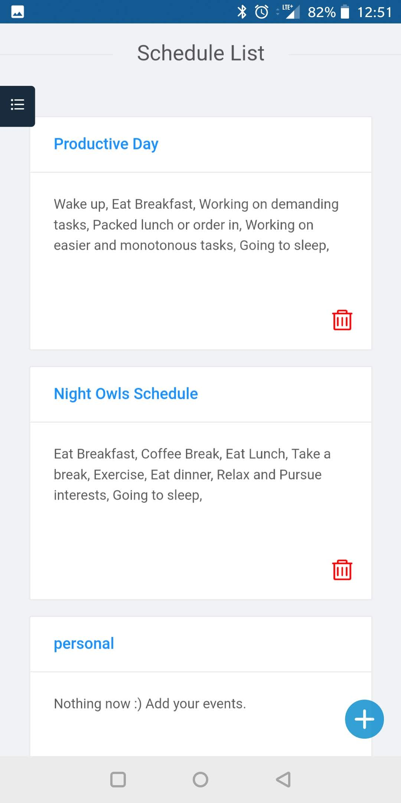
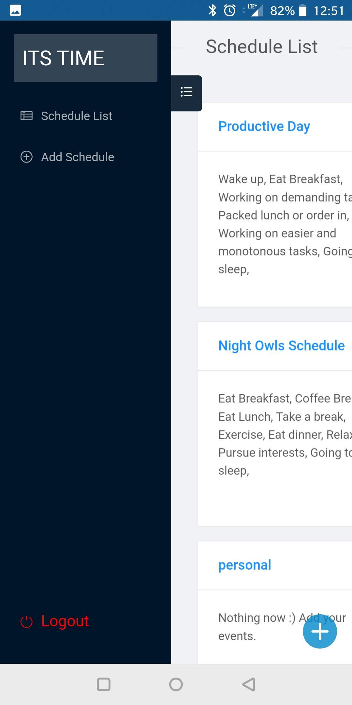
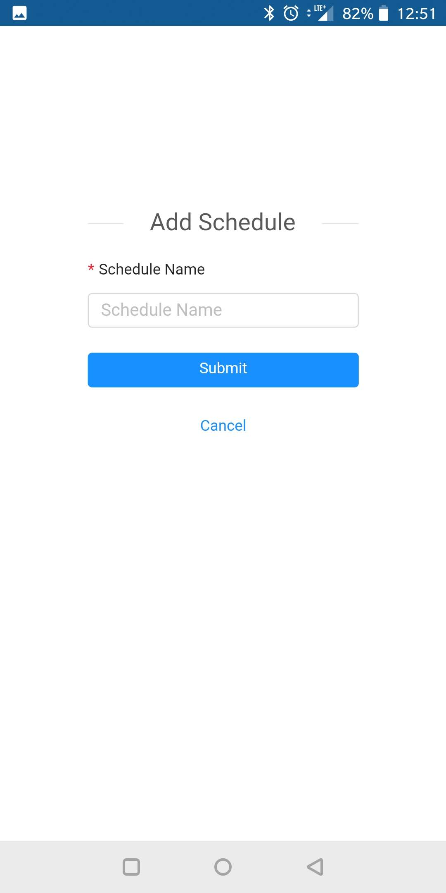
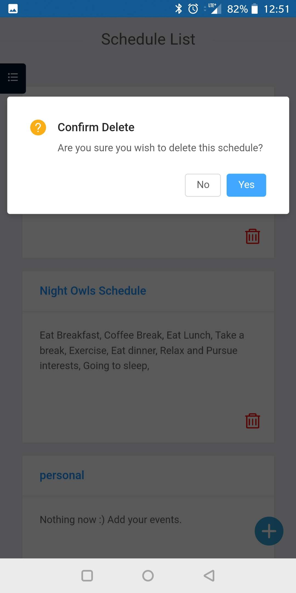
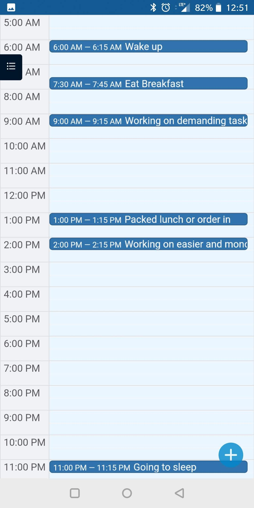
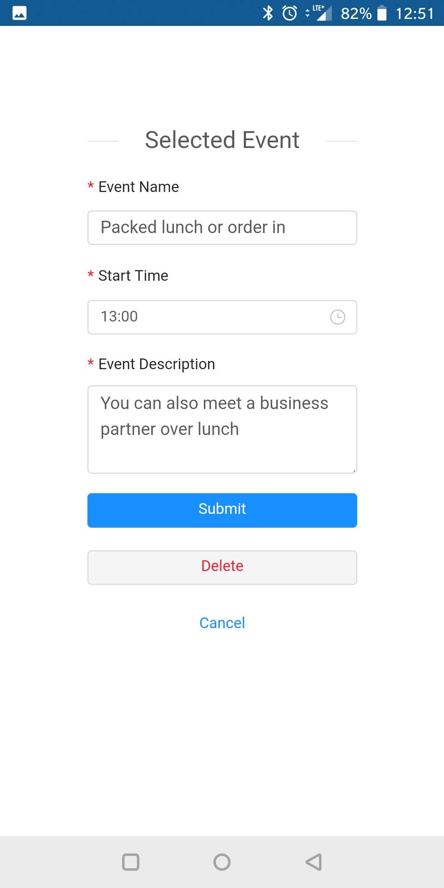

[](https://travis-ci.com/GX-CHEN/itstime)

# itstime (It's time)

## What is this?

- An web application designed to manage daily plan and schedule.
- UI is optimized for both computer browser and mobile devices. Support add "App Icon" on both Android and iOS devices
- A few recommended schedules will be pre-populated when a new user is registered and login. These schedules are fully customizable

## Demo website

- https://itstime.mobi
- Demo Account: test/test
- You can also register an account, no email or personal info are required. Totally free and anonymous

## What can it do?

### Schedule list view

After login, user will see all available schedule list (each new user will have 4 default ones).

<p float="left">


</p>
<div style="clear: both;"></div>

### Schedule view

Users are able to add, view, edit or delete schedules

<p float="left">


</p>
<div style="clear: both;"></div>

### Event list calendar view (of each schedule)

Each Schedule have a list of events that can be viewed in calendar. Each event support view/add/edit/delete

<p float="left">


<div style="clear: both;"></div>
</p>

### Event view

You can click on event on the calendar, and view details, or edit/delete it. You can also click the "plus" button on the bottom right of the calendar view to add a new event

## How to build

### In local

```javascript
// install global npm package which helps run the app
npm install -g nodemon
npm install -g serve

// install dependencies for both server and client side
cd server
npm install

cd ../client
npm install
```

### global command to host all the files

```javascript
/** Assume you're in the root directory
  * Go to server directory first, run server-side first
  * Then go to client directory, run client-side
  */
cd server
npm start

cd ../client
npm install
```

### to server the React file in production mode

- For the client side, production ready bundle file can be achieved by running `npm run build`, then you can serve it use the web-server of your choice (Nginx or Apache)
- For the server side, there are few options to run it, and keep it running. I would recommend a tool called PM2 which can help manage Node processes very easily
